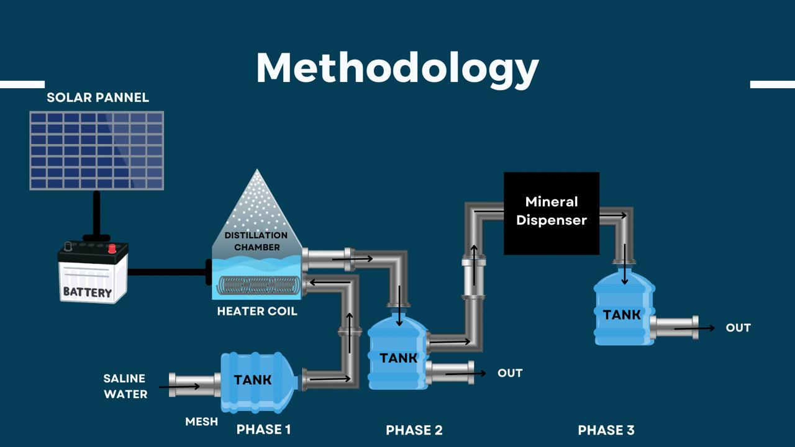

 

  

  

    "PORTABLE SALINE WATER SYNTHESIZER AND PURIFIER"
     
     
    <a href="DROP DOCUMENTATION/DROP DOCUMENTATION .pdf"><strong>Explore the docs »</strong></a>
     
     
    <a href="https://dropdashboard.vercel.app">Website</a>
    .
    <a href="https://drive.google.com/file/d/1Wi6vfuJlRBywGkcgFmGns0ZW9G2aeki2/view?usp=drivesdk">View Demo</a>
    .
    <a href="https://github.com/Shivanaik11/drop/issues">Report a Bug</a>
  

   

## Table Of Contents
* [About the Project](#about-the-project)
* [Methodology](#methodology)
* [Three-Phase Workflow](#three-phase-workflow)
* [License](#license)

## About The Project
Drop Desalination is a groundbreaking solution designed to provide portable and efficient desalination of water. With its compact design, it is easy to transport and operate, making it an ideal choice for remote locations, disaster relief, and daily use in areas with limited fresh water access.

## Methodology

1. **User Setup:**
   - Users visit [dropdashboard.vercel.app](https://dropdashboard.vercel.app) to learn about the device and its operation.

2. **Water Input:**
   - The device accepts saltwater or brackish water as input.
   - A pre-filtration stage removes large impurities to prepare the water for the desalination process.

3. **Desalination Process:**
   - The system employs a thermal distillation unit to remove salt and impurities effectively.
   - This ensures a high standard of water quality suitable for various applications.

4. **Water Output:**
   - The desalinated water is collected in a separate chamber, ready for use.
   - Sensors monitor water quality in real-time, providing feedback on parameters like salinity and turbidity.

5. **Portability:**
   - Designed to be easily carried and transported, even on a moped, Drop is perfect for on-the-go needs.

## Three-Phase Workflow

1. **Phase 1 - Initial Desalination:**
   - The raw water is passed through a thermal distillation unit to remove salts and heavy impurities.
   - This stage ensures a significant reduction in salinity levels, preparing the water for further use.

2. **Phase 2 - Application-Specific Processing:**
   - After Phase 1, the water undergoes processing for specific applications.
   - If the application specified on the website is industrial or construction-related, the water is exited for use at this stage.
   - For drinking water applications, the water proceeds to Phase 3.

3. **Phase 3 - Drinking Water Enhancement:**
   - For drinking water, calcium and magnesium are added using an integrated dispenser system.
   - This step ensures the water meets health standards and enhances taste and quality.
   - The final product is fresh, drinkable water that can be accessed via the built-in smart dispenser.

## Features

- Compact and portable design
- Real-time water quality monitoring
- Easy to set up and maintain
- Ideal for remote locations and emergency situations

## License

Distributed under the MIT License. See `LICENSE` for more information.

